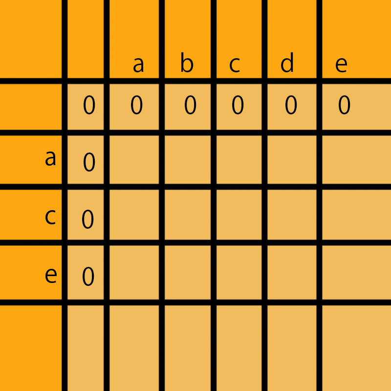
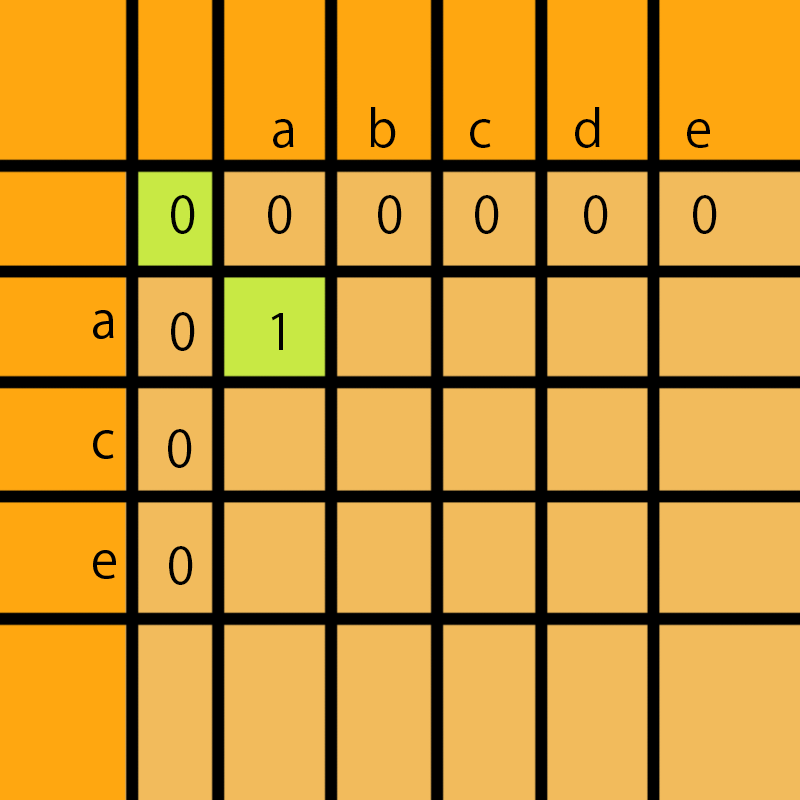
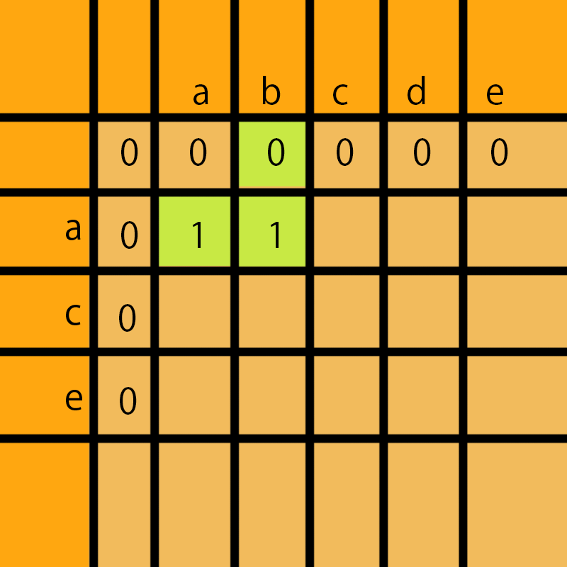
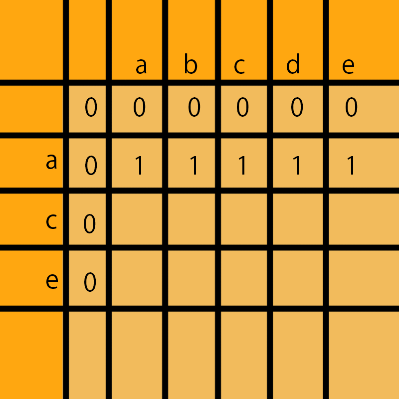
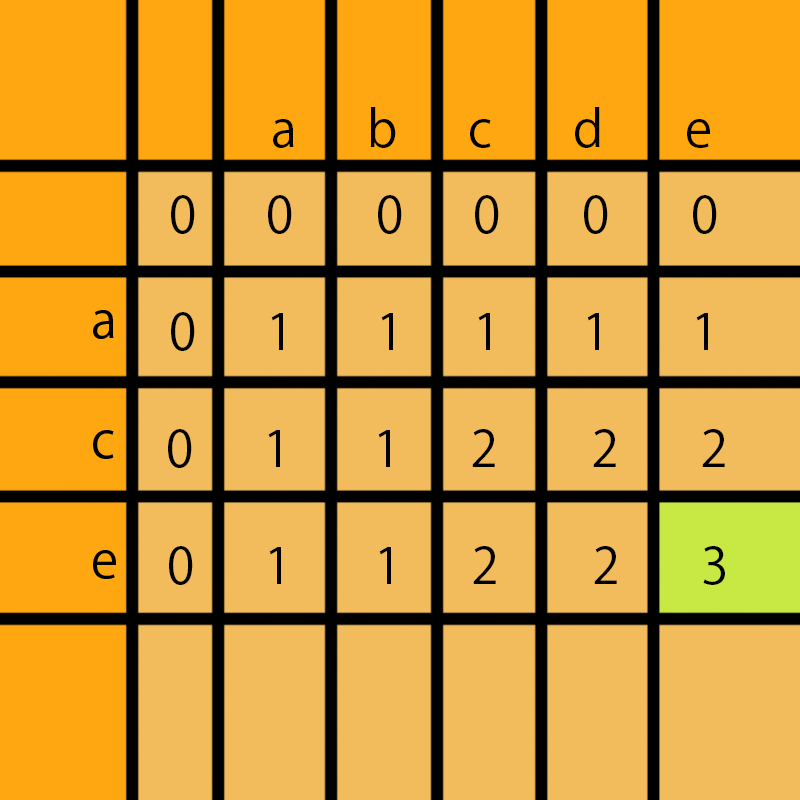

```js
/**
 * 字符串算法
 *
 * 在virtual DOM做Diff Patch操作中，有一条准则就是同一层的节点进行diff patch，从一个dom
 * 节点转换为另外一个dom节点的过程我们可以抽象的看成从字符串ABCDEFG切换到ACDFG, 如何保证
 * 在操作过程中尽量只做节点移动，减少插入和删除的操作使我们的目标。
 *
 * 这个练习主要围绕字符串操作进行这一方面的理解。
 */

/**
 * 最长公共子序列
 *
 * 一个字符串的 子序列 是指这样一个新的字符串：它是由原字符串在不改变字符的相对
 * 顺序的情况下删除某些字符（也可以不删除任何字符）后组成的新字符串。
 * 例如，"ace" 是 "abcde" 的子序列，但 "aec" 不是 "abcde" 的子序列。
 * 两个字符串的「公共子序列」是这两个字符串所共同拥有的子序列。
 * 若这两个字符串没有公共子序列，则返回 0。
 *
 * 参考：https://leetcode-cn.com/problems/longest-common-subsequence/
```

## 动态规划

采用二维数组矩阵方式

```js
var longestCommonSubsequence = function(txt1, txt2) {
  let dp = [new Array(txt2.length + 1).fill(0)]; // 以txt2的长度构造一个一维数组, fill方法填充数组, 每一项都是0, dp = [0,...,0]
  for (let i = 0; i < txt1.length; i++) {
    // 以txt1的长度遍历
    dp[i + 1] = [0]; // 矩阵原点为坐标[0,0], 所以dp二维数组是从 dp[1] 开始, 每一列的第一位都是0, dp[1] = [0]
    for (let j = 0; j < txt2.length; j++) {
      if (txt1[i] === txt2[j]) {
        dp[i + 1][j + 1] = dp[i][j] + 1; // txt1中字符 == txt2中字符, 取左上对角 + 1
      } else {
        dp[i + 1][j + 1] = Math.max(dp[i][j + 1], dp[i + 1][j]); //txt1中字符 !== txt2中字符, 取左上最大值
      }
    }
  }
  return dp[dp.length - 1][dp[0].length - 1]; //返回矩阵右下角的值
};
```

途中矩阵 x 轴为第一维数组, 每一列为第二维数组






采用一维数组方式

```js
var longestCommonSubsequence = function(txt1,txt2){
  let dp = (new Array(txt2.length + 1)).fill(0);
  let last;
  let tmp;
  for(lat i = 0; i < txt1.length; i++ ){
    last = dp[0];
    for(let j =0; j < txt2.length; j++){
      if(txt1[i] === txt2[j]){
        tmp = last + 1;
      }else{
        tmp = Match.max(dp[j+1],dp[j])
      }
      last = dp[j+1]
      dp[j+1] = tmp
    }
  }

  return dp[dp.length - 1]
}
```
