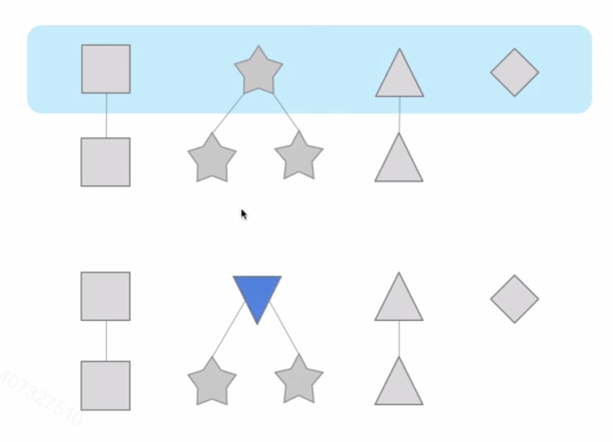
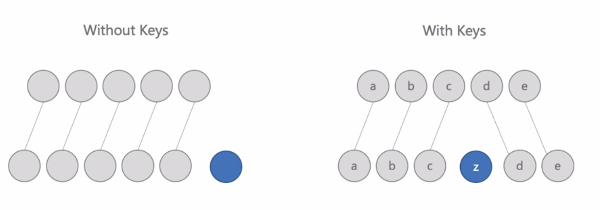

# Diff 算法

## Virtual DOM

为什么要用 Virtual Dom
回答： 操作 DOM 是一件很耗费性能的事情， 我们可以考虑通过 js 来对象来模拟 DOM 对象， 操作 JS 对象比操作 DOM 对象省时 --- 这是一种错误的说法， 确实操作 js 对象比操作 dom 性能高， 但是操作 virtual dom 并不能减少操作 dom， 只是通过 diff path 算法， 可以大大提高操作效率， 并不能提高操作性能

框架帮我们抽象出一层 virtual dom， 通过 vm， 框架可以把 vm 适配到不同的显示端， 有各种可能性

## Diff

什么是 diff
通俗说， 就是将老虎变成大象需要几步？

### diff 策略

1. 按照 tree 的层级进行 diff（level by level）
   

2. 按照类型进行 diff
   
   上下 vm 树对比， 先比较第一层， 发现有个 vm 类型不一致， 虽然他们的子节点是同一类型， 但是 diff 会删除原来的 vm， 创建新的类型
3. 列表 diff
   
   通过 key， 对列表中子节点作标记
